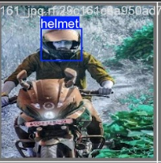
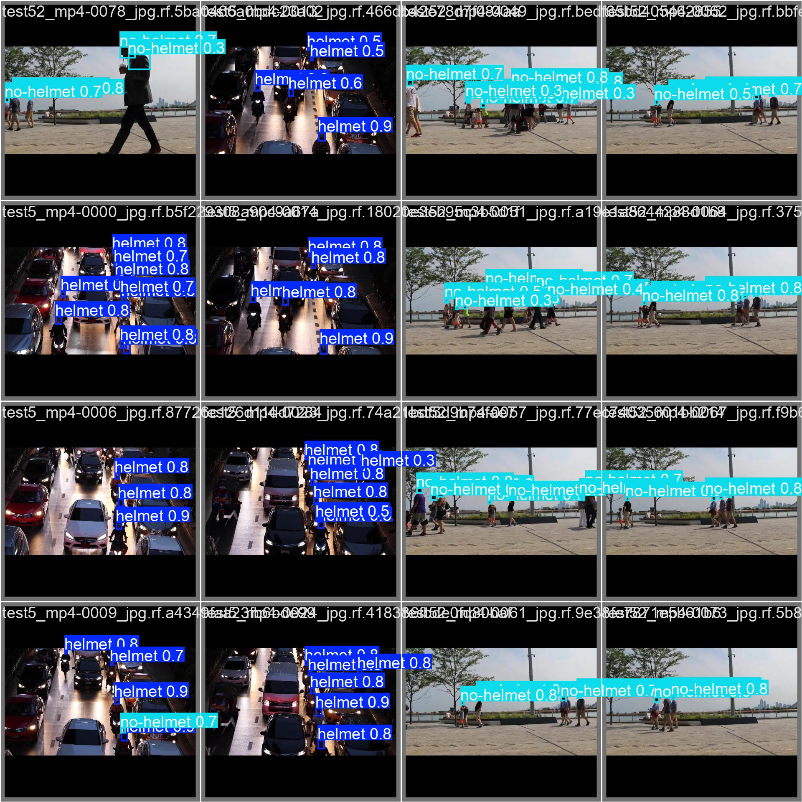
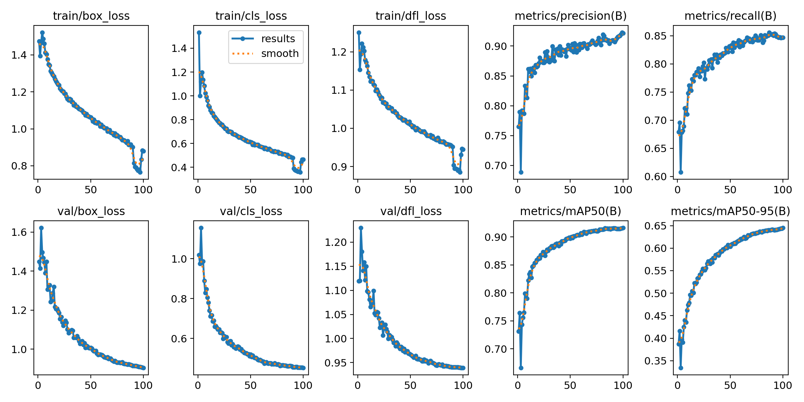

# 🪖 Helmet Detection Using YOLO11s

Real-time helmet violation detection system using YOLO11s, optimized for speed and deployment in road-safety monitoring systems.

# 🚀 Overview

This project focuses on detecting Helmet and No-Helmet riders using a custom-trained YOLO11s model.

The model is optimized for:

⚡ Real-time inference

🎯 High accuracy on custom dataset

🪶 Lightweight deployment on edge/servers

🔧 Exportable to ONNX, TensorRT, CoreML, TFLite

# 📌 Features

Detects helmet and no-helmet riders.

Supports real-time video / webcam inference.

Compatible with Flask, FastAPI, OpenCV apps.

Trained using extensive augmentations.

Export-ready for ONNX / TensorRT / TFLite.

Super-fast: 50–70 FPS on T4 GPU.

# 🗂 Dataset

Dataset Link:
https://app.roboflow.com/smarthsrp/helmet-and-non-helmet-detection-03zb2/2

Total Images: ~10,000

Split	Count
Train	7,978
Valid	1,236
Test	762

Each image contains annotations for:

helmet

no_helmet

# 🧪 Data Augmentation

To improve generalization, both Roboflow augmentations and YOLO11 augmentations were applied.

# 1️⃣ Roboflow Augmentations (Pre-processing)

## Applied before training:

| Augmentation          | Purpose                             |
| --------------------- | ----------------------------------- |
| Auto-Orient Fix       | Correct camera orientation via EXIF |
| Random Rotation       | Simulate angle variations           |
| Random Flip           | Left–right variations               |
| Brightness / Exposure | Lighting variation                  |
| Sharpness             | Improve clarity                     |
| Resize 640×640        | YOLO input size                     |


## 2️⃣ YOLO11 In-Training Augmentations
perspective=0.0004,
flipud=0.0,
fliplr=0.5,
mosaic=1.0,
mixup=0.12,
copy_paste=0.05,
hsv_h=0.012,
hsv_s=0.5,
hsv_v=0.3,
degrees=4.0,
translate=0.1,
scale=0.6,
shear=1.0

## Explanation of Key Augmentations
Geometric
| Aug         | Value  | Why                   |
| ----------- | ------ | --------------------- |
| fliplr      | 0.5    | Left-right variations |
| scale       | 0.6    | Distance variation    |
| translate   | 0.1    | Off-centered boxes    |
| degrees     | 4°     | Slight camera tilt    |
| shear       | 1.0    | Light distortions     |
| perspective | 0.0004 | Minimal warping       |

Color
| Aug   | Purpose                     |
| ----- | --------------------------- |
| hsv_h | Slight hue shift            |
| hsv_s | Strong saturation variation |
| hsv_v | Brightness adjustment       |

Aug	Purpose
| Aug        | Purpose                                |
| ---------- | -------------------------------------- |
| mosaic     | Mixes 4 images → strong generalization |
| mixup      | Blends images                          |
| copy_paste | Clones objects for variety             |


# 📈 Results

After 100 epochs:

| Metric        | Score |
| ------------- | ----- |
| **Precision** | 0.92  |
| **Recall**    | 0.85  |
| **mAP50**     | 0.92  |
| **mAP50-95**  | 0.65  |


⚡ Inference Speed: 50–70 FPS on NVIDIA T4
🔥 Perfect for real-time CCTV, traffic monitoring, and IoT devices.

# 🧰 Installation
```bash
pip install ultralytics
```
# 🧪 Inference Examples
## Image Prediction
```python
from ultralytics import YOLO

model = YOLO("helmet_baseline.pt")
results = model("test.jpg")
results[0].show()
```
## Webcam / Video
```python
results = model.predict(source=0, show=True)
```

# 📸 Sample Detection Results

Here are some examples of the model detecting license plates:

<p align="center">
  
  <br>
  <em>Single Image Inference</em>
</p>

<p align="center">
  
  <br>
  <em>Model performance on multiple images in a batch.</em>
</p>

<p align="center">
  
  <br>
  <em>Training Metrics (Precision, Recall, mAP, Loss Curves)</em>
</p>

## Acknowledgements

This project uses the following open-source datasets for training the helmet detection model:

1. **Bike Helmet Detection Dataset**  
   - Author: Bike Helmets  
   - Source: [Roboflow Universe](https://universe.roboflow.com/bike-helmets/bike-helmet-detection-2vdjo)  
   - License: Open Source  
   - Year: 2021  

2. **Helmet Detection Dataset**  
   - Author: ImageRecognition  
   - Source: [Roboflow Universe](https://universe.roboflow.com/imagerecognition-43zpb/helmet-detection-ntbfz)  
   - License: Open Source  
   - Year: 2024

# 🔗 Contact

Kshitij Lalge

AI/ML Enthusiast

📌 GitHub: https://github.com/Guardian-22

📧 Email: work.kshitij.lalge@gmail.com